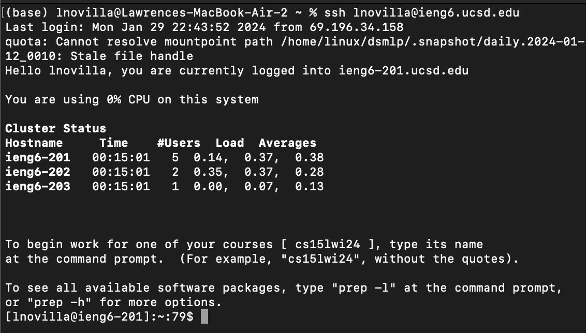
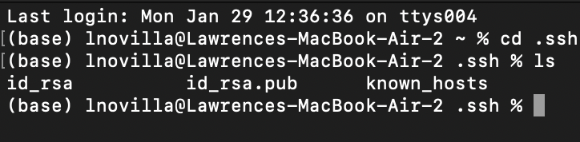

# CSE 15L Lab Report 2
```ChatServer.java```
```
import java.io.BufferedWriter;
import java.io.FileWriter;
import java.io.IOException;
import java.io.PrintWriter;
import java.net.URI;
import java.nio.file.Files;
import java.nio.file.Paths;
import java.util.List;

class StringHandler implements URLHandler {
    List<String> chat_log;
    String path;

    StringHandler(String path) throws IOException {
    this.path = path;
    this.chat_log = Files.readAllLines(Paths.get(path));
  }
  public String handleRequest(URI url) throws IOException{
    String query = url.getQuery();
      if (url.getPath().equals("/add-message")) {
        if (query != null && query.startsWith("s=")) {

            String user = query.split("user=")[1].replaceAll("\\+", " ");
            String message = query.split("s=")[1].split("&")[0].replaceAll("\\+", " ");

            String newChat = String.format("%s: %s \n", user, message);

            this.chat_log.add(newChat);

            return String.join("\n", chat_log) + "\n";
        }
          else{
            return "/add requires query parameter";
          }
      }
      else{
        return "/add required query parameter";
      }
    }
}

class ChatServer {
  public static void main(String[] args) throws IOException {
    if(args.length == 0){
      System.out.println("Missing both port number and file path! For the first argument (port number), try any number between 1024 to 49151. For the second argument (file path), give a path to a text file.");
      return;
    }
    if(args.length == 1){
      System.out.println("Missing port number or file path! For the first argument (port number), try any number between 1024 to 49151. For the second argument (file path), give a path to a text file.");
      return;
    }

    int port = Integer.parseInt(args[0]);

    Server.start(port, new StringHandler(args[1]));
  }
}
```

```Server.java```
import java.io.IOException;
import java.io.OutputStream;
import java.net.InetSocketAddress;
import java.net.InetAddress;
import java.net.URI;

import com.sun.net.httpserver.HttpExchange;
import com.sun.net.httpserver.HttpHandler;
import com.sun.net.httpserver.HttpServer;

interface URLHandler {
    String handleRequest(URI url) throws Exception;
}

class ServerHttpHandler implements HttpHandler {
    URLHandler handler;
    ServerHttpHandler(URLHandler handler) {
      this.handler = handler;
    }
    public void handle(final HttpExchange exchange) throws IOException {
        // form return body after being handled by program
        try {
            String ret = handler.handleRequest(exchange.getRequestURI());
            // form the return string and write it on the browser
            exchange.sendResponseHeaders(200, ret.getBytes().length);
            OutputStream os = exchange.getResponseBody();
            os.write(ret.getBytes());
            os.close();
        } catch(Exception e) {
            String response = e.toString();
            exchange.sendResponseHeaders(500, response.getBytes().length);
            OutputStream os = exchange.getResponseBody();
            os.write(response.getBytes());
            os.close();
        }
    }
}

public class Server {
    public static void start(int port, URLHandler handler) throws IOException {
        HttpServer server = HttpServer.create(new InetSocketAddress(port), 0);

        //create request entrypoint
        server.createContext("/", new ServerHttpHandler(handler));

        //start the server
        server.start();
        System.out.println("Server started!");
    }
}
## add-message example 1


## Which methods in your code are called?
The methods that are called are ```handle()```,  ```start()```, ```handleRequest()```, and ```main()```.

## What are the relevant arguments to those methods, and the values of any relevant fields of the class?

#### class ```StringHandler```

```List<String> chat_log``` = list of ```newChats``` - lines added to chat log
```String path``` = all lines of chats.txt

##### ```handleRequest(URI url)```

Argument: ```URI url = exchange.getRequestURI()```

Fields: 

```query``` = query of server url 
```user``` = string of username from query "jpolitz" and "lawrence"
```message``` = string of message from query - "Hello" and "pls give me 3 points"
```new chat``` = user: message - 
```path``` = txt file when compiled (chats.txt)

#### class ```ServerHttpHandler```

```URLHandler handler```
    
##### ```handle()```

Argument: ```URLHandler handler``` - initializes handler field

#### class ```Server```
##### ```start()```

Arguments: ```int port```, ```URLHandler handler```

Fields: 

```HttpServer server``` - created with port

#### class ```ChatServer```
##### ```main()```

Fields: 
```int port = args[0]``` - provided when compiled

## How do the values of any relevant fields of the class change from this specific request? If no values got changed, explain why.

The list ```chat_logs``` is modified because the newChat's are added when the query of the website is changed.

## add-message example 2


## Which methods in your code are called?
The methods that are called are ```handleRequest()```.

## What are the relevant arguments to those methods, and the values of any relevant fields of the class?
The relative argument to ```the handleRequest()``` method is the url of the website. The fields message, user, and newChat are changed to the values in the query.

## How do the values of any relevant fields of the class change from this specific request? If no values got changed, explain why.

The list ```chat_logs``` is modified because the newChat's are added when the query of the website is changed.





Takeaway:
From week 2, I learned how to create a server where I am able to change what is printed out using the values in the query. Additionally, I learned how to use commands such as cd, ls, man, and pwd to navigate and manipulate my files.
