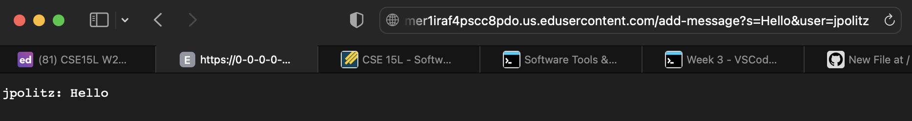
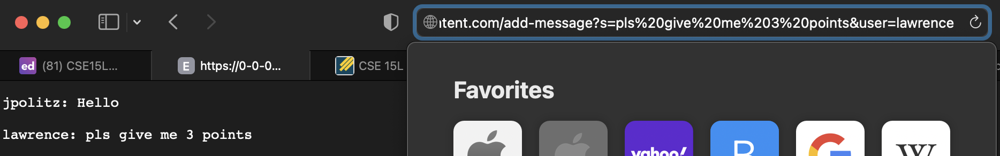

# CSE 15L Lab Report 2

```
import java.io.BufferedWriter;
import java.io.FileWriter;
import java.io.IOException;
import java.io.PrintWriter;
import java.net.URI;
import java.nio.file.Files;
import java.nio.file.Paths;
import java.util.List;

class StringHandler implements URLHandler {
    List<String> chat_log;
    String path;

    StringHandler(String path) throws IOException {
    this.path = path;
    this.chat_log = Files.readAllLines(Paths.get(path));
  }
  public String handleRequest(URI url) throws IOException{
    String query = url.getQuery();
      if (url.getPath().equals("/add-message")) {
        if (query != null && query.startsWith("s=")) {

            String user = query.split("user=")[1].replaceAll("\\+", " ");
            String message = query.split("s=")[1].split("&")[0].replaceAll("\\+", " ");

            String newChat = String.format("%s: %s \n", user, message);

            this.chat_log.add(newChat);

            return String.join("\n", chat_log) + "\n";
        }
          else{
            return "/add requires query parameter";
          }
      }
      else{
        return "/add required query parameter";
      }
    }
}

class ChatServer {
  public static void main(String[] args) throws IOException {
    if(args.length == 0){
      System.out.println("Missing both port number and file path! For the first argument (port number), try any number between 1024 to 49151. For the second argument (file path), give a path to a text file.");
      return;
    }
    if(args.length == 1){
      System.out.println("Missing port number or file path! For the first argument (port number), try any number between 1024 to 49151. For the second argument (file path), give a path to a text file.");
      return;
    }

    int port = Integer.parseInt(args[0]);

    Server.start(port, new StringHandler(args[1]));
  }
}
```
## add-message example 1


## add-message example 2


### Which methods in your code are called?
The methods that are called are ```handle()```,  ```start()```, ```handleRequest()```, and ```main()```.

### What are the relevant arguments to those methods, and the values of any relevant fields of the class?
#### class ```StringHandler```

### Class Fields:

```List<String> chat_log``` = list of ```newChats```

```String path``` = all lines of chats.txt

##### ```handleRequest(URI url)```

###### Argument: ```URI url = exchange.getRequestURI()```

###### Method Fields: 

```query``` = query of server url 

```user``` = string of username from query "jpolitz" and "lawrence"

```message``` = string of message from query - "Hello" and "pls give me 3 points"

```new chat``` = user: message

```path``` = txt file when compiled (chats.txt)

#### class ```ServerHttpHandler```

### Class Fields: ```URLHandler handler```
    
##### ```handle()```

## Argument: ```URLHandler handler``` - initializes handler field

#### class ```Server```
##### ```start()```

## Arguments: ```int port```, ```URLHandler handler```

## Method Fields: 

```HttpServer server``` - created with port

#### class ```ChatServer```
##### ```main()```

Fields: 
```int port = args[0]``` - provided when compiled

### How do the values of any relevant fields of the class change from this specific request? If no values got changed, explain why.
